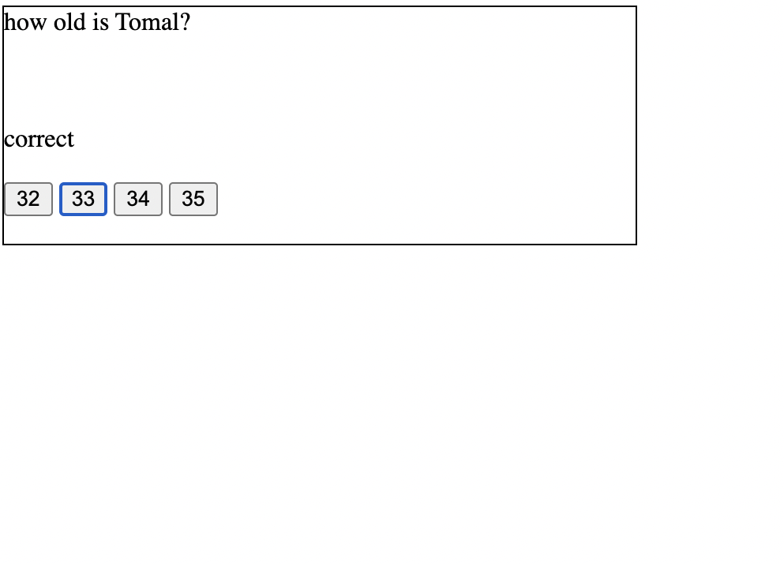

# Code Quiz

## Description
This is the Forth assignment, the task was to create a functional app from scratch which provides a series of questions and must be answered correctly to win/complete the app/game.

deployed website URL: 

gitHub repo URL: 

## Usage

When the user clicks on the start button, a series of questions and four different answers for each questions are displayed. 
If the correct answer is selected then the message "correct" will be displayed otherwise "wrong" is displayed.
If all 4 questions are answered correctly, the message; "you win" will be displayed.

the Quiz is not yet completed and will be submitted again!

//

## License

Please refer to the LICENSE in the repo.
