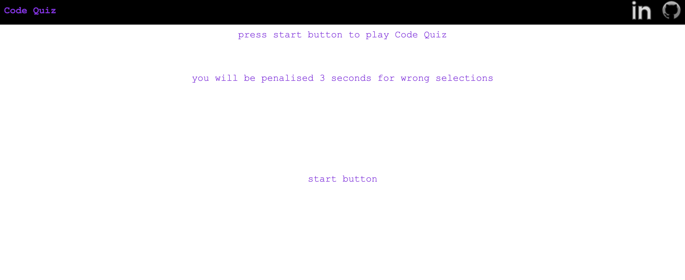
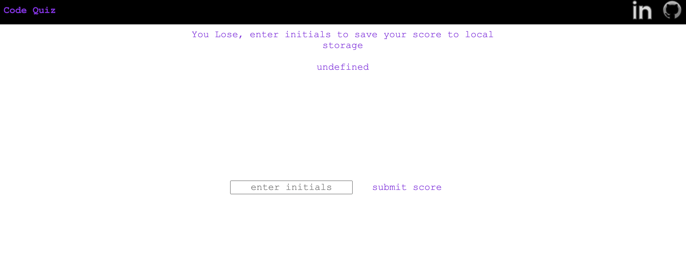

# Code Quiz

## Description
An interactive client side web application will display a series of questions and must be answered correctly complete the quiz.
A time limit of 15 seconds will be set and all answers must be completed before the time runs out.

deployed website URL: https://tomal1.github.io/Code_quiz/

gitHub repo URL: https://github.com/Tomal1/challenge_WK4_code_quiz

## Usage

When the user clicks on the start button, a series of questions and four different answers for each questions will be displayed. 

The app has a timer of 15 seconds initiated when the start button is selected and each time wrong answer is selected, a deduction of 3 seconds is penalised from the timer.

If the correct answer is selected then the message "correct" will be displayed and next question is displayed, otherwise "wrong" is displayed and 3 seconds is deducted.

If the time runs out, the message; "you lose" will be displayed and allowing you to submit your score to local storage.

If all 4 questions are answered correctly, the message; "you win" will be displayed and allowing you to submit your score to local storage.

## License

Please refer to the LICENSE in the repo.
